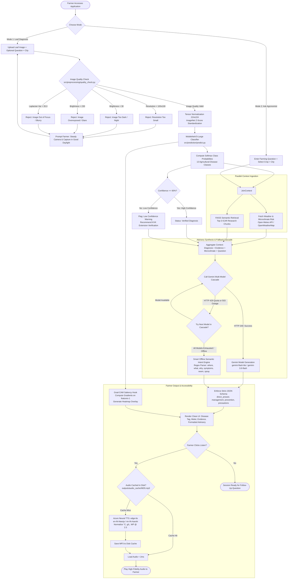
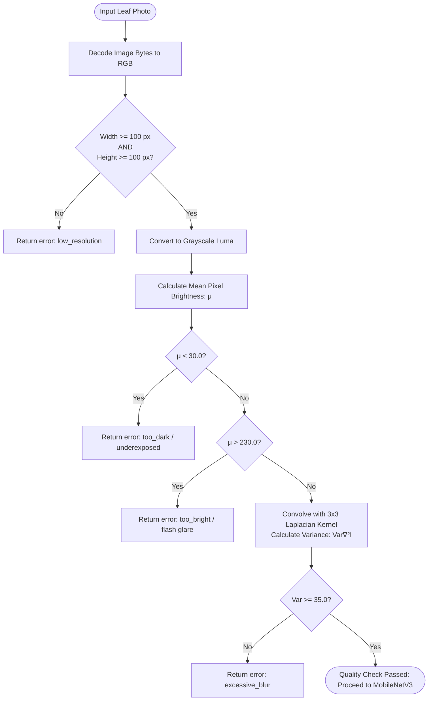
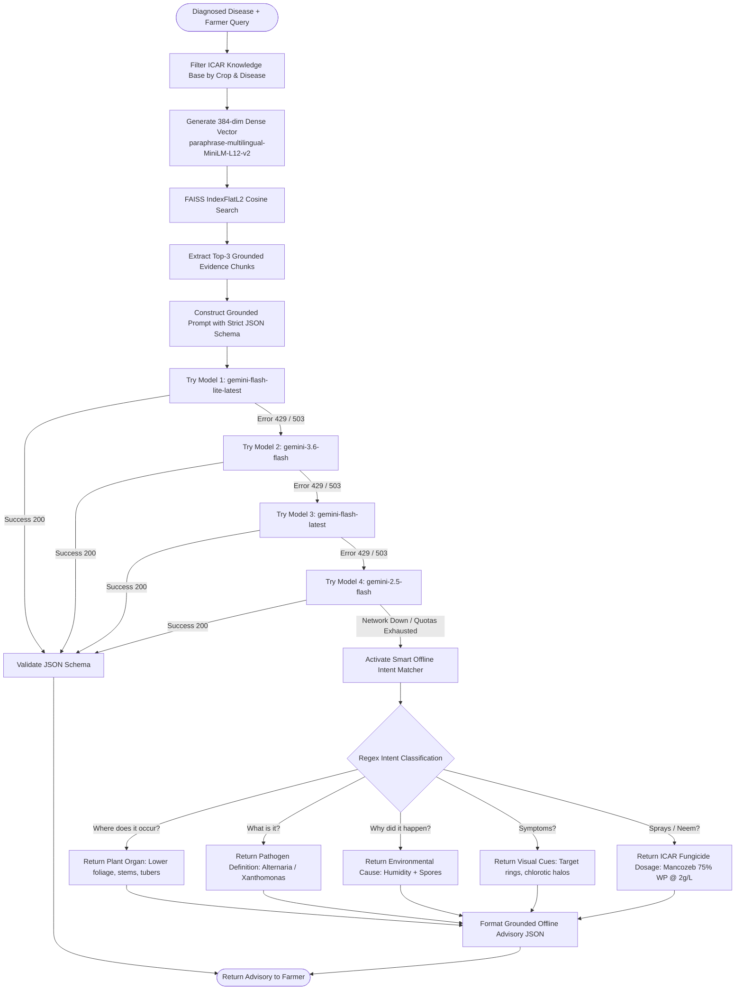
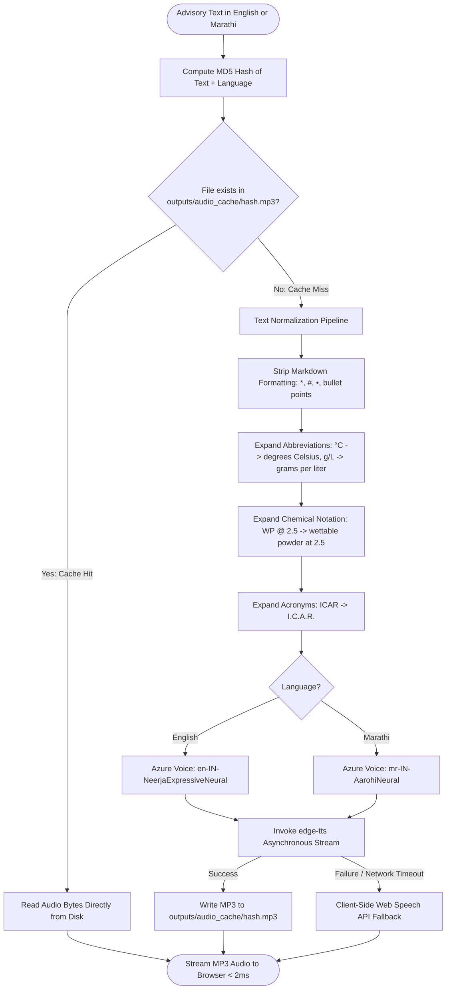

# 📊 AI Agriculture Assistant — System Flowcharts

This document provides visual flowcharts covering the end-to-end execution pipeline, decision gates, parallel processing subsystems, and offline fallback mechanisms.

---

## 1. Master System Flowchart



---

## 2. Image Quality Gate Decision Flowchart



---

## 3. RAG & Gemini Multi-Model Cascade Flowchart



---

## 4. Text-to-Speech (TTS) Normalization & Caching Flowchart



---

## 5. ASCII System Flowchart (For Project Reports & PPT Slides)

```text
================================================================================================
                                AI AGRICULTURE ASSISTANT FLOWCHART
================================================================================================

 [ Farmer Uploads Leaf Image ]               [ Farmer Enters Direct Question ]
              │                                              │
              ▼                                              │
  ┌───────────────────────┐                                  │
  │  Image Quality Gate   │                                  │
  │ • Blur (Laplacian)    │──[Fail: Blur/Dark/Glare]──► [ Re-Prompt Farmer with Advice ]
  │ • Brightness (Exposure│                                  │
  │ • Resolution (>=100px)│                                  │
  └───────────┬───────────┘                                  │
              │ (Pass)                                       │
              ▼                                              │
  ┌───────────────────────┐                                  │
  │ MobileNetV3-Large CNN │                                  │
  │ • Softmax Probability │                                  │
  │ • Grad-CAM Heatmap    │                                  │
  └───────────┬───────────┘                                  │
              │                                              │
              ▼                                              ▼
  ┌────────────────────────────────────────────────────────────────────────┐
  │                 Parallel Context Ingestion Engine                      │
  │  • Real-Time Weather: Open-Meteo (Humidity, Temp, Infection Risk)      │
  │  • RAG Vector Retrieval: FAISS + ICAR Grounded Research Evidence Chunks│
  └───────────────────────────────────┬────────────────────────────────────┘
                                      │
                                      ▼
  ┌────────────────────────────────────────────────────────────────────────┐
  │               Google Gemini Multi-Model Cascade Layer                  │
  │  Primary: gemini-flash-lite  ──► Secondary: gemini-3.6-flash           │
  │  (Fallback on 429 Quota Exceeded / 503 Network Unavailable)            │
  └───────────────────────────────────┬────────────────────────────────────┘
                                      │
              ┌───────────────────────┴───────────────────────┐
              ▼                                               ▼
     [ Gemini Online ]                              [ Network / Quota Offline ]
  Enforce Strict JSON Schema                     Smart Semantic Intent Regex Engine
  (Direct Answer, Sprays, Safety)                (Where, What, Why, Symptoms, Neem)
              │                                               │
              └───────────────────────┬───────────────────────┘
                                      ▼
  ┌────────────────────────────────────────────────────────────────────────┐
  │                         Farmer Results Panel                           │
  │  • Primary Disease & Calibrated Confidence Meter                       │
  │  • Grad-CAM Visual Heatmap Highlighting Foliar Lesions                 │
  │  • Direct Answer to Question + ICAR Management & Prevention            │
  └───────────────────────────────────┬────────────────────────────────────┘
                                      │
                                      ▼
  ┌────────────────────────────────────────────────────────────────────────┐
  │                  Human-Like Neural Speech Subsystem                    │
  │  • Disk Cache Lookup (<2ms)                                            │
  │  • Agricultural Text Normalizer (°C, g/L, WP @ 2.5)                    │
  │  • Microsoft Azure Neural Voice: Neerja (English) & Aarohi (Marathi)   │
  └────────────────────────────────────────────────────────────────────────┘
```
