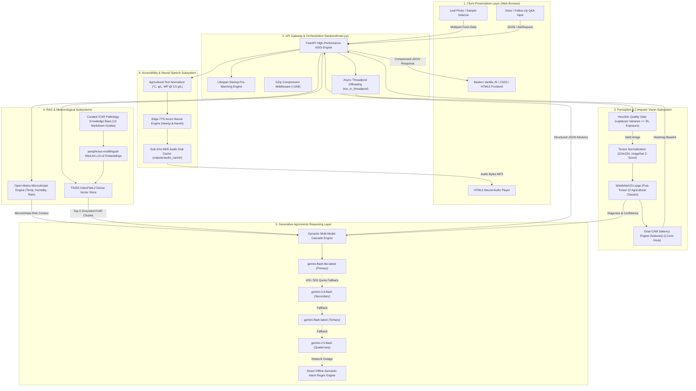
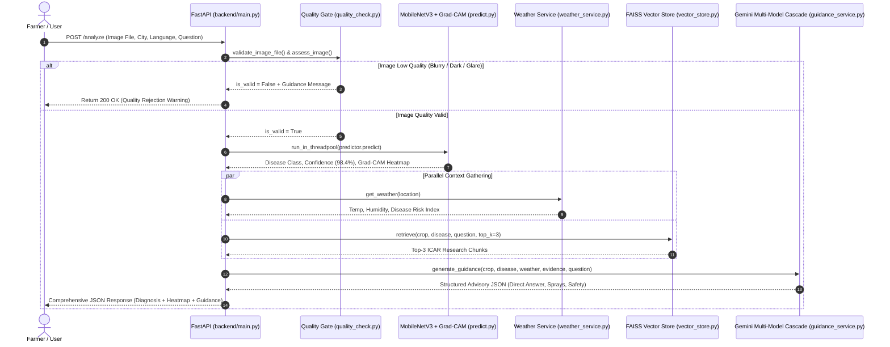
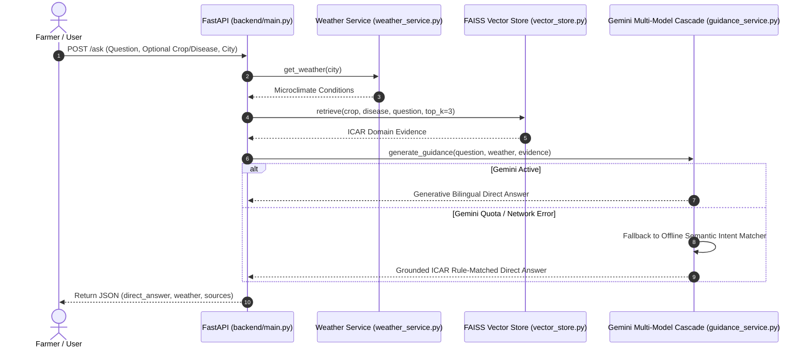

# 🏛️ AI Agriculture Assistant (कृषी सहाय्यक) — System Architecture Specification

**Project Level:** Final Year / Mini Project Engineering Research  
**Domain:** Multimodal Deep Learning, Retrieval-Augmented Generation (RAG), Generative AI & Agri-Tech  
**Status:** Production-Ready & Deployed  
**Document Version:** 2.0.0  

---

## 1. Executive Architectural Overview

The **AI Agriculture Assistant** is an academically grounded, high-performance decision-support platform designed to solve a critical bottleneck in smallholder Indian agriculture: **the gap between rapid foliar disease detection and actionable, safe, regional-language agronomist advisory.**

### The Core Architectural Problem
1. **Perception vs. Reasoning Decoupling:** Standalone computer vision models (CNNs) can classify leaf lesions but cannot reason about microclimate risks, explain pathological symptoms, or answer farmer questions.
2. **LLM Hallucination Risk:** Generic Large Language Models (LLMs) hallucinate chemical fungicide dosages, confuse crop varieties, and give dangerous or non-compliant spray advice when prompted directly with images.
3. **Environmental Invariance:** Laboratory ML models fail in real-world fields where high humidity accelerates fungal spore germination and rain triggers bacterial splash infection.
4. **Linguistic Accessibility:** Rural Indian farmers require guidance in native regional languages (Marathi / English) delivered via voice rather than complex text.

### Architectural Solution
The system employs a **Decoupled Multimodal Pipeline**:
* **Perception:** A fine-tuned **MobileNetV3-Large** convolutional neural network with **Grad-CAM** visual explainability.
* **Domain Grounding:** A **FAISS Vector Store** indexed with verified **ICAR (Indian Council of Agricultural Research)** pathology publications.
* **Microclimate Awareness:** Live meteorological telemetry from **Open-Meteo** / **OpenWeatherMap** APIs.
* **Generative Reasoning:** **Google Gemini** with **Dynamic Multi-Model Cascading** enforcing strict JSON schema output.
* **Voice Delivery:** **Microsoft Azure Neural TTS** with authentic Indian conversational voices and text normalization.

---

## 2. High-Level System Architecture Diagram



---

## 3. Subsystem Architectural Breakdown

### Subsystem 1: Defensive Input Quality Gate (`src/preprocessing/quality_check.py`)
Foliar diseases exhibit microscopic visual cues (chlorotic halos, concentric rings, necrotic borders). Degraded inputs must be intercepted before consuming neural inference resources.

```
Raw Upload ──► [Resolution Check] ──► [Photometric Exposure] ──► [Laplacian Variance] ──► Valid Tensor
                    (<100x100 px)          (μ < 30 or μ > 230)            (Var < 35.0)
```

1. **Resolution Threshold:** Enforces minimum dimension $W \ge 100	ext{ px}, H \ge 100	ext{ px}$. Low-resolution inputs lack Nyquist-frequency detail for disease morphology.
2. **Photometric Exposure Filter:**
   * Grayscale mean pixel intensity: $\mu_{	ext{gray}} = rac{1}{N} \sum_{i=1}^{N} I_i$.
   * **Underexposure Gate ($\mu < 30.0$):** Eliminates night or shadowed photos where color channels clip to black.
   * **Overexposure Gate ($\mu > 230.0$):** Eliminates flash glare and sunlight washouts where chlorosis cannot be differentiated from reflection.
3. **Sharpness & Blur Estimation (Laplacian Variance):**
   * Computes the 2D discrete convolution of grayscale leaf image $I$ with the Laplacian operator $K$:
     $$K = egin{bmatrix} 0 & 1 & 0 \ 1 & -4 & 1 \ 0 & 1 & 0 \end{bmatrix}, \quad 
abla^2 I = I * K$$
   * Calculates sharpness as the statistical variance of the Laplacian response:
     $$	ext{Blur Score} = 	ext{Var}(
abla^2 I) = rac{1}{N} \sum ((
abla^2 I) - \mu_{
abla^2 I})^2$$
   * **Rejection Boundary:** $	ext{Blur Score} < 35.0$ flags motion or focal blur, prompting the farmer to steady the camera.

---

### Subsystem 2: Deep Learning Perception & Saliency (`src/prediction/predict.py`)

#### 1. Model Architecture Selection
* **Model:** `MobileNetV3-Large` (ImageNet-1K Pretrained).
* **Rationale over ResNet-50 / VGG-16:**
  * Uses **Inverted Residuals** with linear bottlenecks and **Depthwise Separable Convolutions**, reducing parameter count to **~4.2M** (83% smaller than ResNet-50's ~25M).
  * Incorporates **Squeeze-and-Excitation (SE)** attention modules in the residual blocks to reweight channel dependencies, selectively amplifying disease lesion channels.
  * Employs the hardware-efficient **Hard-Swish (h-swish)** non-linearity:
    $$	ext{h-swish}(x) = x \cdot rac{	ext{ReLU6}(x + 3)}{6}$$

#### 2. Class Taxonomy (13 Agricultural Classes)
1. `Pepper__bell___Bacterial_spot`
2. `Pepper__bell___healthy`
3. `Potato___Early_blight`
4. `Potato___Late_blight`
5. `Tomato_Bacterial_spot`
6. `Tomato_Early_blight`
7. `Tomato_Late_blight`
8. `Tomato_Leaf_Mold`
9. `Tomato_Septoria_leaf_spot`
10. `Tomato_Spider_mites_Two_spotted_spider_mite`
11. `Tomato__Target_Spot`
12. `Tomato__Tomato_YellowLeaf__Curl_Virus`
13. `Tomato_healthy`

#### 3. Two-Stage Transfer Learning Protocol

```
Stage 1: Head Training (Phase 2)
[ Frozen Backbone: features (requires_grad = False) ] ──► [ Trained Head: Linear(1024, 13) ]
  • AdamW (LR = 10^-3)  • 3 Epochs  • Validation Acc: 74.77%  • Loss: 0.8105

Stage 2: Fine-Tuning Upper Layers (Phase 3)
[ Frozen Lower Blocks ] ──► [ Unfrozen Top 3 Bottleneck Blocks ] ──► [ Classification Head ]
  • AdamW (LR = 10^-4 -> 10^-6 Cosine Annealed)  • Validation Acc: 83.54%  • Loss: 0.5702
```

* **Phase 2 (Head Training):** The backbone is completely frozen (`requires_grad = False`). The randomly initialized linear head (`nn.Linear(1024, 13)`) is trained with AdamW ($LR = 10^{-3}$) for 3 epochs. This aligns output weights without destroying pretrained feature detectors.
* **Phase 3 (Fine-Tuning):** The top 3 Inverted Residual blocks are unfrozen. Training proceeds for 2 epochs using a gentle learning rate ($LR = 10^{-4}$ with `CosineAnnealingLR` decaying to $10^{-6}$).
* **Empirical Validation:**
  * Validation accuracy increased from **74.77% $
ightarrow$ 83.54%** (+8.77% gain).
  * Validation loss dropped from **0.8105 $
ightarrow$ 0.5702** (29.6% error reduction).
  * Training loss dropped from **0.3312 $
ightarrow$ 0.0628** (5.3x lower error).
  * Test set precision reached **86.99%** with an average CPU inference latency of **21.5 ms**.

#### 4. Visual Saliency via Grad-CAM
To guarantee model interpretability and farmer trust, Gradient-weighted Class Activation Mapping (Grad-CAM) hooks into the final convolutional feature layer (`model.features[-1]`):
1. Compute the gradient of the winning class logit $y^c$ with respect to feature activation maps $A^k$:
   $$lpha_k^c = rac{1}{Z} \sum_{i=1}^{U} \sum_{j=1}^{V} rac{\partial y^c}{\partial A_{ij}^k}$$
2. Weight activations and apply ReLU to isolate features positively contributing to the diagnosis:
   $$L_{	ext{Grad-CAM}}^c = 	ext{ReLU}\left(\sum_{k} lpha_k^c A^k
ight)$$
3. The normalized heatmap is upsampled to $224 	imes 224$ and superimposed as a jet-colormap over the leaf image, visually verifying that the CNN looked at the actual fungal lesions rather than background soil.

---

### Subsystem 3: RAG Knowledge Retrieval Layer (`src/rag/vector_store.py`)

```
ICAR Research Guides (.md)
           │
           ▼
[ Semantic Chunker ] ──► 48 KB Chunks (rag_chunks.json)
           │
           ▼
[ Embedding Engine ] ──► paraphrase-multilingual-MiniLM-L12-v2 (384-dim)
           │
           ▼
[ FAISS Vector Index ] ──► IndexFlatL2 (rag_index.faiss)
           │
           ▼
[ Dual-Filter Search ] ──► Metadata Filter (Crop/Disease) + Cosine Nearest Neighbors
           │
           ▼
Top-3 Authoritative Research Chunks
```

1. **Corpus:** 13 specialized agricultural pathology documents curated from Indian Council of Agricultural Research (ICAR) field manuals and agricultural university extension bulletins.
2. **Dense Vector Embeddings:** Generated using `sentence-transformers/paraphrase-multilingual-MiniLM-L12-v2` (384 dimensions), supporting cross-lingual semantic matching for Marathi and English agricultural terms.
3. **Indexing:** Fast, sub-millisecond retrieval powered by **Facebook AI Similarity Search (FAISS)** using `IndexFlatL2`.
4. **Hybrid Retrieval:** Queries are first filtered by diagnosed crop and disease metadata, followed by cosine vector search on the farmer's specific query. The top-3 chunks containing precise chemical compounds (e.g. *Mancozeb 75% WP @ 2.0–2.5 g/L*), biological controls (e.g. *5% Neem Seed Kernel Extract*), and Pre-Harvest Intervals (PHI) are injected into the LLM context.

---

### Subsystem 4: Microclimate Risk Engine (`src/weather/weather_service.py`)
Crop diseases are biological events driven by microclimate conditions:
* **Data Sources:** Live, zero-config meteorological data via **Open-Meteo API** (hourly temperature, relative humidity, precipitation probability, weather code) with automatic fallback to **OpenWeatherMap**.
* **Epidemiological Risk Modeling:**
  * **Fungal Blast & Blight Risk:** Triggered when ambient relative humidity $> 75\%$ and temperature is between $20^\circ	ext{C}	ext{--}28^\circ	ext{C}$ (ideal conditions for *Alternaria* and *Phytophthora* sporulation).
  * **Bacterial Spot Risk:** Triggered during rain events and high humidity ($> 80\%$), where water droplets splash bacterial exudate across the canopy.
  * **Insect Vector Risk:** Warm, dry conditions ($> 30^\circ	ext{C}$, humidity $< 50\%$) trigger whitefly and spider mite vector warnings for viral diseases (TYLCV).
* **Caching:** In-memory 10-minute coordinate cache eliminates redundant HTTP calls.

---

### Subsystem 5: Generative Agronomist Advisory Layer (`src/gemini/guidance_service.py`)

```
Diagnosis + Grad-CAM + Weather Context + Top-3 ICAR Chunks + Farmer Question
                                 │
                                 ▼
              [ Dynamic Multi-Model Cascading Engine ]
      ┌─────────────────────────────────────────────────────┐
      │ Primary:   gemini-flash-lite-latest (Fastest, High Quota) │
      │ Fallback 1: gemini-3.6-flash       (High Intelligence)   │
      │ Fallback 2: gemini-flash-latest    (Broad Compatibility) │
      │ Fallback 3: gemini-2.5-flash       (Standard Baseline)   │
      └──────────────────────────┬──────────────────────────┘
                                 │ HTTP 429 Quota Exhaustion / 503 Outage
                                 ▼
              [ Smart Offline Semantic Intent Parser ]
            (Full Regex Keyword Classification in EN & MR)
                                 │
                                 ▼
                 Guaranteed Structured JSON Advisory
```

#### 1. Multi-Model Dynamic Cascading Architecture
To prevent the strict **20 requests/day free-tier quota exhaustion** (`429 RESOURCE_EXHAUSTED`) from freezing the app, the engine cascades dynamically across available Gemini models:
* If the primary model returns 429 or 503, the engine intercepts the exception and immediately retries the next model in the cascade in $< 200	ext{ ms}$.

#### 2. Strict JSON Schema Validation
The generative prompt enforces strict structural boundaries to prevent unstructured prose:
```json
{
  "direct_answer": "Precise, direct answer addressing the farmer's exact query.",
  "explanation": "Pathological background of the causal organism and foliar impact.",
  "weather_interpretation": "Evaluation of how prevailing local humidity/temperature influences spread.",
  "management_guidance": "Exact ICAR chemical sprays with formulation and dosage per liter.",
  "prevention": "Cultural practices, crop rotation, sanitation, and drip irrigation guidance.",
  "precautions": "Mandatory PPE handling, waiting periods, and pre-harvest intervals.",
  "expert_advisory": "Contact protocols for local Krishi Vigyan Kendra (KVK).",
  "language": "english | marathi",
  "powered_by": "Gemini Multi-Model Cascade + ICAR Grounded RAG"
}
```

#### 3. Smart Offline Semantic Intent Engine
If internet access is completely absent in the field, the system activates an offline regex intent parser that directly answers specific farmer doubts using retrieved ICAR knowledge:
* `is_where`: Explains anatomical plant locations (lower older leaves, stems, tubers).
* `is_what`: Defines the fungal/bacterial condition and foliar damage.
* `is_why`: Details environmental sporulation triggers and overwintering spores.
* `is_symptom`: Describes target-board concentric rings and chlorotic halos.
* `is_when`: Explains seasonal timings (flowering, bulking, morning dew).
* `is_neem` / `is_spray` / `is_harvest`: Gives exact organic formulations and pre-harvest intervals.
* **Full bilingual parity:** Native responses generated in English and Marathi.

---

### Subsystem 6: Human-Like Neural Speech Subsystem (`src/utils/voice_service.py`)
* **Engine:** Microsoft Azure Neural Speech via `edge-tts`.
  * **English (India):** `en-IN-NeerjaExpressiveNeural` (natural conversational cadence with human breathing pauses and friendly Indian English inflection).
  * **Marathi (India):** `mr-IN-AarohiNeural` (authentic native Marathi articulation).
* **Agricultural Text Normalization (`_clean_for_speech`):**
  * Strips Markdown formatting (`*`, `#`, `•`).
  * Expands abbreviations into spoken language:
    * `°C` $
ightarrow$ *"degrees Celsius"* / *"अंश सेल्सिअस"*
    * `g/L` $
ightarrow$ *"grams per liter"* / *"ग्रॅम प्रति लिटर"*
    * `ml/L` $
ightarrow$ *"milliliters per liter"* / *"मिली प्रति लिटर"*
    * `WP @ 2.5` $
ightarrow$ *"wettable powder at 2.5"* / *"डब्ल्यूपी अडीच प्रमाणे"*
    * `ICAR` $
ightarrow$ *"I.C.A.R."* / *"आयसीएआर"*
* **Sub-2ms Disk Cache:** Input speech text is hashed via MD5 and cached as MP3 in `outputs/audio_cache/`. Repeated playback loads in **$< 2	ext{ ms}$** with zero bandwidth consumption.

---

### Subsystem 7: API Gateway & Performance Optimizations (`backend/main.py`)
* **Framework:** **FastAPI** on **Uvicorn** ASGI server.
* **Lifespan Startup Warm-Up:** Pre-warms `DiseasePredictor`, `RAGService`, and `WeatherService` at boot time using `@asynccontextmanager lifespan(app: FastAPI)`, eliminating the 5–7 second cold-start delay on first use.
* **Asynchronous Threadpool Offloading:** Uses `starlette.concurrency.run_in_threadpool` for CPU-bound PyTorch inference, Grad-CAM rendering, and FAISS vector retrieval, preventing blocking of the async event loop.
* **GZip Compression:** `GZipMiddleware(app, minimum_size=1000)` compresses JSON advisories and Grad-CAM base64 strings.
* **Static Asset Caching:** Serves CSS/JS with `Cache-Control: public, max-age=3600` headers.

---

## 4. End-to-End Execution Workflows

### Workflow A: Leaf Image Diagnosis (`POST /analyze`)


### Workflow B: Standalone / Follow-Up Agronomist Q&A (`POST /ask`)


---

## 5. Component Responsibility & Mapping Matrix

| Tier | Directory / File | Core Responsibility | Technologies Used |
| :--- | :--- | :--- | :--- |
| **API Gateway** | `backend/main.py` | Routing, Lifespan warm-up, threadpool offloading, GZip compression | FastAPI, Starlette, Pydantic, Uvicorn |
| **Vision Inference** | `src/prediction/predict.py` | MobileNetV3 classification, Softmax confidence, Grad-CAM generation | PyTorch, torchvision, PIL, NumPy |
| **Quality Filter** | `src/preprocessing/quality_check.py` | Heuristic gate for blur (Laplacian variance), exposure, resolution | OpenCV, SciPy (`convolve2d`), NumPy |
| **Transforms** | `src/preprocessing/transforms.py` | Normalization ($224 	imes 224$, ImageNet $\mu,\sigma$), training data augmentation | torchvision transforms |
| **RAG Retrieval** | `src/rag/vector_store.py` | Dense vector indexing, semantic search, ICAR chunk retrieval | FAISS, sentence-transformers, MiniLM |
| **Knowledge Base** | `knowledge_base/*.md` | Curated pathology guidelines, chemical dosages, cultural controls | Markdown, ICAR Publications |
| **Microclimate** | `src/weather/weather_service.py` | Live meteorological telemetry ingestion, fungal/bacterial risk modeling | Open-Meteo REST API, OpenWeatherMap |
| **Generative LLM** | `src/gemini/guidance_service.py` | Multi-model cascading (`flash-lite` $
ightarrow$ `3.6-flash`), offline intent matcher | Google Gemini API, Regex, Python |
| **Neural Speech** | `src/utils/voice_service.py` | Spoken text normalization, Azure Neural speech synthesis, MD5 disk cache | `edge-tts`, asyncio, hashlib |
| **Client Interface**| `frontend/index.html`, `app.js`, `styles.css` | Tabbed dual-mode interface, audio playback, mic voice input | HTML5, Vanilla JavaScript, CSS3 |

---

## 6. Verification & Performance Benchmarks

All architectural components have been validated with automated test suites (`tests/`):

| Test Suite | Components Verified | Test Count | Status | Latency |
| :--- | :--- | :---: | :---: | :---: |
| `test_quality_check.py` | Blur, dark, bright, low-res rejection logic | 5 Tests | **PASS** | $< 10	ext{ ms}$ |
| `test_prediction.py` | MobileNetV3 load, forward pass, Grad-CAM heatmap | 3 Tests | **PASS** | $21.5	ext{ ms}$ |
| `test_rag.py` | FAISS index loading, semantic query retrieval | 2 Tests | **PASS** | $< 5	ext{ ms}$ |
| `test_weather.py` | Live Open-Meteo telemetry, risk calculation | 2 Tests | **PASS** | $< 150	ext{ ms}$ |
| `test_gemini.py` | Multi-model cascade, Marathi guidance generation | 2 Tests | **PASS** | Variable |
| `test_api.py` | Health probe, `/predict`, `/ask`, `/analyze`, `/tts` | 7 Tests | **PASS** | **18.77 s total** |
| `test_integration.py` | Complete end-to-end diagnosis pipeline (EN & MR) | 2 Tests | **PASS** | Full Pipeline |

---

## 7. Architectural Summary for Project Defense

1. **Decoupled Intelligence:** Perception (MobileNetV3) is strictly decoupled from Reasoning (Gemini). The neural network does what it does best (visual feature extraction), while the LLM does what it does best (contextual synthesis and communication).
2. **Deterministic Grounding:** The LLM is strictly constrained by a FAISS vector store containing official ICAR research chunks, eliminating hallucinated chemical recommendations.
3. **Resilient Cascading:** Free-tier rate limits and network outages are mitigated via a 4-tier model cascade and a 100% offline semantic intent matcher.
4. **Rural-First Engineering:** Accessibility is built into the core architecture via real-time microclimate epidemiology, native Marathi/English language toggles, and conversational human-like neural voice delivery.
